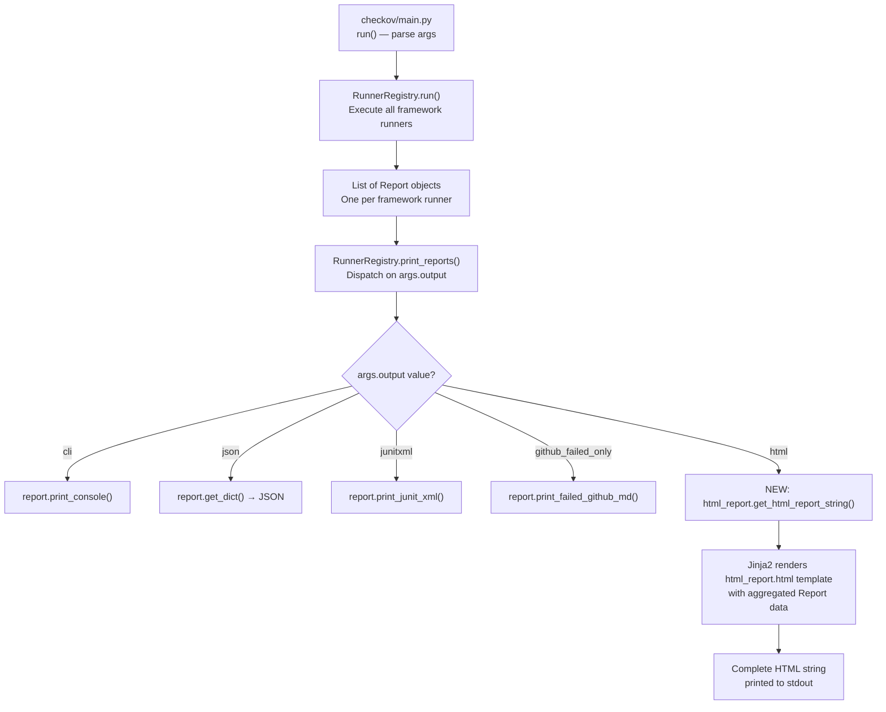

# Technical Specification

# 0. Agent Action Plan

## 0.1 Intent Clarification

### 0.1.1 Core Feature Objective

Based on the prompt, the Blitzy platform understands that the new feature requirement is to add an HTML report output capability to the Checkov CLI tool, enabling users to view infrastructure-as-code scan results as a visually polished, browser-renderable HTML page styled with Material Design 3 principles.

- **Primary Requirement — HTML Output Format**: Checkov currently supports four output formats (`cli`, `json`, `junitxml`, `github_failed_only`) as defined in `OUTPUT_CHOICES` at `checkov/common/runners/runner_registry.py` line 8. The feature adds a fifth output format, `html`, that generates a self-contained HTML file containing the complete scan report viewable in Chrome
- **Single-Page Report View**: The HTML output consists of exactly one page — the "Results Report" — that consolidates all passed, failed, skipped checks and parsing errors from all framework runners into a unified, navigable HTML document
- **Material Design 3 Styling**: The report adopts Google's Material Design 3 (M3) design system (https://m3.material.io/) for visual styling, ensuring a modern and professional appearance with M3 color tokens, typography scale, and component patterns
- **CLI Parameter Extension**: A new output choice `html` is added to the existing `-o` / `--output` CLI argument, seamlessly integrating with the existing argument parser at `checkov/main.py` lines 161–163
- **No Backend/API Required**: This is a purely client-side, static HTML file generation feature. No server endpoints, WebSocket connections, or runtime services are involved. The HTML file is written to stdout or to a file path, consistent with how existing formats behave
- **Implicit Requirement — Self-Contained Output**: The generated HTML must be a single self-contained file that loads external resources (Material Design CSS/JS, fonts) from CDN links, allowing offline viewing of structure with online styling, or fully embedded inline styles for complete offline support

### 0.1.2 Special Instructions and Constraints

- **Minimal Change Clause**: Make only the changes that are absolutely necessary to implement this frontend feature. Do not refactor, optimize, or modify existing code unless it is directly required for the new feature to work. The goal is to add functionality with minimal disruption to the existing system
- **Isolation Principle**: New code must be isolated in dedicated files and modules when possible, avoiding modification of existing component interfaces or props
- **Existing Pattern Adherence**: The implementation must follow the existing output format pattern established by `cli`, `json`, `junitxml`, and `github_failed_only` — adding a new branch in `RunnerRegistry.print_reports()` and a corresponding method on the `Report` class
- **No Component Refactoring**: Existing `Record`, `Report`, `RunnerRegistry`, and `RunnerFilter` classes must not be restructured. Only additive changes (new methods, new imports) are permitted
- **Design System**: Use Material Design 3 (https://m3.material.io/) as the design component system for the HTML report's visual presentation
- **Browser Target**: The HTML output must render correctly in Chrome

### 0.1.3 Technical Interpretation

These feature requirements translate to the following technical implementation strategy:

- To **register the new output format**, we will add `'html'` to the `OUTPUT_CHOICES` list in `checkov/common/runners/runner_registry.py` and add `HTML = 4` to the `OutputFormat` enum in `checkov/common/models/enums.py`
- To **generate the HTML report**, we will create a new module `checkov/common/output/html_report.py` containing an `HtmlReport` class (or a set of functions) that accepts `Report` data and renders it into a complete HTML document using Python's `jinja2` templating engine (already installed as a transitive dependency via `cloudsplaining`)
- To **style the report with Material Design 3**, we will create an HTML template at `checkov/common/output/templates/html_report.html` that references Material Design 3 CDN resources and applies M3 design tokens for colors, typography, spacing, and component patterns
- To **integrate into the CLI pipeline**, we will add a new conditional branch in `RunnerRegistry.print_reports()` at `checkov/common/runners/runner_registry.py` that handles `args.output == 'html'` by delegating to the new HTML report generation logic
- To **expose the parameter**, we will add `'html'` to the `choices` list in the `--output` argument definition at `checkov/main.py` line 161 (indirectly through the `OUTPUT_CHOICES` import)
- To **ensure test coverage**, we will create test modules under `tests/common/output/` that validate HTML report generation, template rendering, and correct data inclusion


## 0.2 Repository Scope Discovery

### 0.2.1 Comprehensive File Analysis

#### Existing Files Requiring Modification

The following existing files must be modified to integrate the HTML output feature. Each modification is minimal and additive, confined to inserting new branches, imports, or values without restructuring existing logic.

| File Path | Modification Type | Purpose | Approximate Location |
|---|---|---|---|
| `checkov/common/runners/runner_registry.py` | ADD value to list, ADD import, ADD branch | Add `'html'` to `OUTPUT_CHOICES` (line 8); add HTML report import; add `elif args.output == 'html'` branch in `print_reports()` (lines 42–81) | Lines 8, 1–5, 42–81 |
| `checkov/common/models/enums.py` | ADD enum value | Add `HTML = 4` to `OutputFormat` enum | Line 31 (after `JUNIT_XML = 3`) |
| `checkov/common/output/report.py` | ADD method | Add `print_html()` and/or `get_html_string()` method to `Report` class for HTML rendering delegation | End of class (after line 150) |
| `checkov/main.py` | No direct change needed | `OUTPUT_CHOICES` is imported from `runner_registry.py` and used directly in `add_parser_args()` at line 161; adding `'html'` to `OUTPUT_CHOICES` propagates automatically | Line 161 (automatic propagation) |

#### Integration Point Discovery

- **CLI Argument Parsing**: `checkov/main.py` line 161 — the `--output` argument's `choices=OUTPUT_CHOICES` parameter automatically picks up the new `'html'` value once it is added to the `OUTPUT_CHOICES` list in `runner_registry.py`
- **Report Dispatch**: `checkov/common/runners/runner_registry.py` `print_reports()` method (lines 42–81) — the central dispatch point where output format routing occurs; a new `elif` branch routes `html` output to the HTML generator
- **Report Data Model**: `checkov/common/output/report.py` `Report` class — the aggregated scan data model that provides `get_dict()`, `get_summary()`, `passed_checks`, `failed_checks`, `skipped_checks`, and `parsing_errors` — all of which the HTML renderer must consume
- **Record Data Model**: `checkov/common/output/record.py` `Record` class — individual check results with fields `check_id`, `check_name`, `check_result`, `code_block`, `file_path`, `file_line_range`, `resource`, `guideline`, `evaluations`, `entity_tags` — all displayed in the HTML report
- **Output Package Namespace**: `checkov/common/output/__init__.py` — may need to export new HTML-related symbols if following the existing `__all__` pattern

#### New Source Files to Create

| File Path | Purpose |
|---|---|
| `checkov/common/output/html_report.py` | Core HTML report generation module containing the rendering logic that transforms `Report` objects into HTML strings using Jinja2 templating |
| `checkov/common/output/templates/html_report.html` | Jinja2 HTML template file implementing the Material Design 3 styled report layout with sections for summary, passed checks, failed checks, skipped checks, and parsing errors |

#### New Test Files to Create

| File Path | Purpose |
|---|---|
| `tests/common/output/__init__.py` | Package initializer for the new output test directory |
| `tests/common/output/test_html_report.py` | Unit tests for the HTML report generation module: validates template rendering, data inclusion, output format correctness, multi-report aggregation, quiet/compact mode support, and edge cases (empty reports, reports with parsing errors) |

### 0.2.2 Web Search Research Conducted

- **Material Design 3 Web Integration**: Researched Material Web (`@material/web`) — Google's official M3 web component library available via CDN at `https://esm.run/@material/web/`. Currently in maintenance mode. For a static HTML report (not a web app), a CSS-only approach using M3 design tokens and principles is more appropriate than full web components
- **CDN Availability**: Confirmed `material-components-web` v14.0.0 available on cdnjs (`https://cdnjs.cloudflare.com/ajax/libs/material-components-web/14.0.0/material-components-web.min.css`). Also identified `mdui` v2 as a lightweight M3-based alternative available via CDN
- **M3 Design Tokens**: Material Design 3 tokens include color roles (primary, secondary, tertiary, error, surface, on-surface), typography scale (display, headline, title, body, label in small/medium/large), spacing based on 8px grid, and shape tokens (border-radius scale). These will be implemented as CSS custom properties in the HTML template
- **Static HTML Report Patterns**: For a Python CLI tool generating static HTML reports, the recommended approach is Jinja2 templating with inline CSS that references M3 design token values, ensuring the report is self-contained and viewable without a build pipeline

### 0.2.3 New File Requirements

**New source files to create:**

- `checkov/common/output/html_report.py` — HTML report rendering engine that accepts Report data, applies Jinja2 templating, and produces a complete HTML document string
- `checkov/common/output/templates/html_report.html` — Material Design 3 styled Jinja2 template defining the report page structure: header with summary dashboard, expandable sections for passed/failed/skipped checks, code block display with syntax context, and parsing error listing

**New test files to create:**

- `tests/common/output/__init__.py` — Package initializer enabling test discovery
- `tests/common/output/test_html_report.py` — Comprehensive test coverage for HTML generation including data completeness assertions, template rendering, empty report handling, multi-framework report aggregation, and Material Design class presence verification

**New configuration:**

- No new configuration files are required. The HTML output format is activated through the existing `-o html` CLI argument pattern. Jinja2 is already available as a transitive dependency


## 0.3 Dependency Inventory

### 0.3.1 Private and Public Packages

The following packages are relevant to the HTML report feature addition. No new external packages need to be added to `setup.py` `install_requires` — the feature relies exclusively on packages already present in the dependency tree.

| Registry | Package Name | Version | Purpose | Status |
|---|---|---|---|---|
| PyPI | `jinja2` | 3.1.6 | HTML template rendering engine — transforms report data into HTML using `html_report.html` template | Already installed (transitive via `cloudsplaining`) |
| PyPI | `markupsafe` | 3.0.3 | HTML escaping and safe string handling for Jinja2 templates — prevents XSS in report output | Already installed (dependency of `jinja2`) |
| PyPI | `colorama` | 0.4.6 | Terminal color initialization used by existing `record.py` and `report.py` — no change needed | Already in `install_requires` |
| PyPI | `termcolor` | 3.1.0 | Colored terminal output used by existing `Report.print_console()` — no change needed | Already in `install_requires` |
| PyPI | `junit-xml` | 1.9 | JUnit XML report generation — existing dependency, no change needed | Already in `install_requires` |
| PyPI | `tabulate` | 0.9.0 | GitHub markdown table generation — existing dependency, no change needed | Already in `install_requires` |
| CDN | `Material Icons` | N/A | Google Material Icons font loaded via CDN link in the HTML template | Referenced in HTML template via `https://fonts.googleapis.com/icon?family=Material+Icons` |
| CDN | `Roboto Font` | N/A | Material Design 3 default typeface loaded via Google Fonts CDN | Referenced in HTML template via `https://fonts.googleapis.com/css2?family=Roboto:wght@400;500;700` |
| PyPI | `pytest` | 5.3.1 | Test framework for new HTML report tests | Already in `extras_require[dev]` |

**Key Observation**: Jinja2 is already available in the installed environment as a transitive dependency of `cloudsplaining>=0.4.1`. However, since it is not explicitly listed in `setup.py` `install_requires`, it should be added to ensure it remains available even if the `cloudsplaining` dependency changes. The recommended addition to `install_requires` in `setup.py` is `"jinja2>=2.11.0"`.

### 0.3.2 Dependency Updates

#### Import Updates

Files requiring new import statements to support HTML report generation:

| File Pattern | Import Change | Purpose |
|---|---|---|
| `checkov/common/output/html_report.py` (NEW) | `from jinja2 import Environment, PackageLoader, select_autoescape` | Jinja2 template engine for HTML rendering |
| `checkov/common/output/html_report.py` (NEW) | `from checkov.common.output.report import Report` | Access to Report data model |
| `checkov/common/output/html_report.py` (NEW) | `from checkov.common.models.enums import CheckResult` | Check result enum for status evaluation |
| `checkov/common/runners/runner_registry.py` | `from checkov.common.output.html_report import get_html_report_string` | Import HTML report generator function |
| `checkov/common/output/report.py` | No new external imports needed | HTML rendering delegated to `html_report.py` |

#### External Reference Updates

| File | Change | Purpose |
|---|---|---|
| `setup.py` | Add `"jinja2>=2.11.0"` to `install_requires` list (line 34–55) | Explicitly declare Jinja2 as a direct dependency for HTML report generation |
| `Pipfile` | Add `jinja2 = ">=2.11.0"` to `[packages]` section | Keep Pipfile synchronized with setup.py per existing convention (see Pipfile line 18 comment) |
| `README.md` | Add documentation for `--output html` flag | Document the new HTML output format option for users |


## 0.4 Integration Analysis

### 0.4.1 Existing Code Touchpoints

#### Direct Modifications Required

- **`checkov/common/runners/runner_registry.py`** — The primary integration point for the HTML output feature:
  - Line 8: Add `'html'` to the `OUTPUT_CHOICES` list, changing it from `['cli', 'json', 'junitxml', 'github_failed_only']` to `['cli', 'json', 'junitxml', 'github_failed_only', 'html']`
  - Lines 1–5: Add import for the HTML report generator function from the new `html_report.py` module
  - Lines 42–81 (`print_reports()` method): Add a new `elif args.output == 'html'` branch that collects reports and delegates to the HTML generation function. This follows the exact same dispatch pattern used by `json` (line 50–51), `junitxml` (line 52–54), and `github_failed_only` (line 55–56)

- **`checkov/common/models/enums.py`** — Enum registry for output formats:
  - Line 31: Add `HTML = 4` to the `OutputFormat` enum after `JUNIT_XML = 3`, maintaining the enumeration pattern

- **`checkov/common/output/report.py`** — Report data model with format-specific rendering methods:
  - Add a `print_html()` method and/or `get_html_string()` method to the `Report` class, following the pattern of `print_console()` (line 83), `print_junit_xml()` (line 110), `print_json()` (line 148), and `print_failed_github_md()` (line 118)

- **`setup.py`** — Package metadata and dependencies:
  - Lines 34–55: Add `"jinja2>=2.11.0"` to the `install_requires` list to explicitly declare the Jinja2 dependency

- **`Pipfile`** — Development environment dependencies:
  - Lines 17–40: Add `jinja2 = ">=2.11.0"` to the `[packages]` section, maintaining synchronization with `setup.py` as noted by the existing comment on Pipfile line 18

#### No Modifications Required

- **`checkov/main.py`** — The `--output` argument at line 161 uses `choices=OUTPUT_CHOICES` which is imported from `runner_registry.py`. Since `OUTPUT_CHOICES` is modified in `runner_registry.py`, the CLI argument automatically accepts `html` without any changes to `main.py`
- **`checkov/common/output/record.py`** — The `Record` class provides all necessary data fields (`check_id`, `check_name`, `check_result`, `code_block`, `file_path`, `file_line_range`, `resource`, `guideline`, `evaluations`, `entity_tags`) that the HTML template will consume. No changes to the Record class are needed
- **`checkov/common/output/graph_record.py`** — The `GraphRecord` extends `Record` and adds `breadcrumbs`. The HTML template will handle both `Record` and `GraphRecord` instances through the shared base interface without requiring modifications

### 0.4.2 Data Flow Through the Integration

The HTML report integrates into the existing scan pipeline at the output rendering stage:



### 0.4.3 Template Data Requirements

The HTML template receives the following data from the `Report` objects, requiring no schema changes:

| Data Source | Field/Method | Usage in HTML Template |
|---|---|---|
| `Report.get_summary()` | `passed`, `failed`, `skipped`, `parsing_errors`, `checkov_version` | Summary dashboard cards at top of report |
| `Report.check_type` | String identifier (e.g., `terraform`, `kubernetes`) | Framework section headers |
| `Report.passed_checks` | List of `Record` objects | Passed checks expandable section |
| `Report.failed_checks` | List of `Record` objects | Failed checks section with code blocks |
| `Report.skipped_checks` | List of `Record` objects | Skipped checks section with suppress comments |
| `Report.parsing_errors` | List of file path strings | Parsing errors section |
| `Record.check_id` | String (e.g., `CKV_AWS_1`) | Check identifier badge |
| `Record.check_name` | String | Check description text |
| `Record.check_result` | Dict with `result` key | Status indicator (pass/fail/skip) |
| `Record.resource` | String | Resource identifier |
| `Record.file_path` | String | File location display |
| `Record.file_line_range` | List of ints | Line range display |
| `Record.code_block` | List of tuples `(line_num, line_text)` | Code snippet display |
| `Record.guideline` | String or None | Remediation guide link |


## 0.5 Design System Compliance

### 0.5.1 System Identification

- **Library**: Material Design 3 (Material You)
- **Version**: CSS-based implementation using M3 design token values; no single package version — design principles applied via custom CSS referencing M3 specifications
- **Status**: To-be-added (as CSS custom properties and CDN font references in the HTML template)
- **Package**: CDN-hosted Google Fonts (Roboto, Material Icons); M3 design tokens implemented as inline CSS custom properties
- **Source**: Official Material Design 3 documentation at https://m3.material.io/ and https://m3.material.io/foundations/design-tokens

Since this is a **static HTML report generated by a Python CLI tool** (not a web application with a JavaScript build pipeline), the implementation uses Material Design 3 **design principles and token values** encoded as CSS custom properties rather than installing an npm package. This approach is the lightest-weight integration that maintains M3 compliance for a single-page, read-only report document.

### 0.5.2 Component Mapping

The HTML report uses native HTML elements styled with M3 design tokens. Since the report is a static, read-only document (not an interactive web application), raw semantic HTML elements styled with M3 CSS classes are the appropriate choice.

| UI Element | HTML Element | M3 Styling Approach | CSS Class / Token | Notes |
|---|---|---|---|---|
| Page Container | `<body>` | M3 surface color, Roboto font | `--md-sys-color-surface`, `font-family: Roboto` | Full-page background and typography |
| Report Header | `<header>` | M3 primary container | `--md-sys-color-primary-container` | Checkov banner with version, scan date |
| Summary Cards | `<div>` styled as cards | M3 elevated card pattern | `--md-sys-color-surface-container-low`, `border-radius` | Four cards: passed, failed, skipped, errors |
| Passed Count Card | `<div>` | M3 tertiary-container color | `--md-sys-color-tertiary-container` | Green-toned success indicator |
| Failed Count Card | `<div>` | M3 error-container color | `--md-sys-color-error-container` | Red-toned failure indicator |
| Skipped Count Card | `<div>` | M3 secondary-container color | `--md-sys-color-secondary-container` | Blue-toned info indicator |
| Section Headers | `<h2>`, `<h3>` | M3 headline typography | `md-typescale-headline-small` | Framework and category headings |
| Check Result Row | `<div>` | M3 list-item pattern | `--md-sys-color-surface-container` | Individual check result display |
| Status Badge | `<span>` | M3 color roles | `--md-sys-color-primary` / `error` / `tertiary` | PASSED / FAILED / SKIPPED indicators |
| Code Block | `<pre><code>` | M3 surface-variant | `--md-sys-color-surface-variant`, monospace font | Source code snippet display |
| Guideline Link | `<a>` | M3 primary color | `--md-sys-color-primary` | Remediation guide URL |
| Data Table | `<table>` | M3 outline-variant borders | `--md-sys-color-outline-variant` | Tabular check detail display |
| Parsing Error Item | `<div>` | M3 error color role | `--md-sys-color-error` | Error file path display |
| Material Icons | `<span class="material-icons">` | Google Material Icons font | CDN: `fonts.googleapis.com/icon?family=Material+Icons` | Icons for status, expand/collapse |

### 0.5.3 Token Mapping

Material Design 3 design tokens applied as CSS custom properties in the HTML template:

| Category | M3 Token Name | CSS Custom Property | Default Value (Light) | Usage |
|---|---|---|---|---|
| Color | Primary | `--md-sys-color-primary` | `#6750A4` | Links, primary actions, active states |
| Color | On-Primary | `--md-sys-color-on-primary` | `#FFFFFF` | Text on primary-colored surfaces |
| Color | Primary Container | `--md-sys-color-primary-container` | `#EADDFF` | Report header background |
| Color | Error | `--md-sys-color-error` | `#B3261E` | Failed check indicators, parsing errors |
| Color | Error Container | `--md-sys-color-error-container` | `#F9DEDC` | Failed count card background |
| Color | Tertiary | `--md-sys-color-tertiary` | `#7D5260` | Passed check accent |
| Color | Tertiary Container | `--md-sys-color-tertiary-container` | `#FFD8E4` | Passed count card background |
| Color | Surface | `--md-sys-color-surface` | `#FFFBFE` | Page background |
| Color | Surface Container | `--md-sys-color-surface-container` | `#F3EDF7` | Check result row background |
| Color | Surface Variant | `--md-sys-color-surface-variant` | `#E7E0EC` | Code block background |
| Color | On-Surface | `--md-sys-color-on-surface` | `#1C1B1F` | Primary text color |
| Color | On-Surface-Variant | `--md-sys-color-on-surface-variant` | `#49454F` | Secondary text color |
| Color | Outline | `--md-sys-color-outline` | `#79747E` | Borders, dividers |
| Color | Outline Variant | `--md-sys-color-outline-variant` | `#CAC4D0` | Subtle borders |
| Typography | Display Medium | `md-typescale-display-medium` | Roboto 45px/52px weight 400 | Report title |
| Typography | Headline Small | `md-typescale-headline-small` | Roboto 24px/32px weight 400 | Section headings |
| Typography | Title Medium | `md-typescale-title-medium` | Roboto 16px/24px weight 500 | Check names, card titles |
| Typography | Body Large | `md-typescale-body-large` | Roboto 16px/24px weight 400 | Primary body text |
| Typography | Body Medium | `md-typescale-body-medium` | Roboto 14px/20px weight 400 | Secondary text, metadata |
| Typography | Label Large | `md-typescale-label-large` | Roboto 14px/20px weight 500 | Badge text, button labels |
| Spacing | Small | `--md-sys-spacing-sm` | `8px` | Tight spacing between elements |
| Spacing | Medium | `--md-sys-spacing-md` | `16px` | Standard component padding |
| Spacing | Large | `--md-sys-spacing-lg` | `24px` | Section spacing |
| Spacing | Extra Large | `--md-sys-spacing-xl` | `32px` | Major section separation |
| Shape | Small | `--md-sys-shape-corner-small` | `8px` | Badges, small elements |
| Shape | Medium | `--md-sys-shape-corner-medium` | `12px` | Cards, containers |
| Shape | Large | `--md-sys-shape-corner-large` | `16px` | Dialogs, large containers |
| Elevation | Level 1 | `box-shadow` | `0 1px 2px rgba(0,0,0,0.3), 0 1px 3px 1px rgba(0,0,0,0.15)` | Card shadows |

### 0.5.4 Gaps Inventory

| Gap | Description | Proposed Resolution |
|---|---|---|
| No Interactive Components | M3 provides interactive web components (buttons, toggles, ripple effects) but the report is a static read-only document | Use M3 visual styling (colors, typography, shape, elevation) without interactive component behavior. Expand/collapse sections use minimal vanilla JavaScript |
| No Build Pipeline | M3 `@material/web` package requires module bundling; Checkov is a Python-only project | Implement M3 design tokens as CSS custom properties directly in the HTML template. Load Roboto font and Material Icons from Google Fonts CDN |
| Code Syntax Highlighting | M3 does not provide a code syntax highlighting component | Use `<pre><code>` with M3 `surface-variant` background and monospace font. Line numbers styled with M3 `on-surface-variant` color |
| Dark Mode | M3 supports dark mode via token override, but adds complexity to the initial implementation | Generate light-theme only for initial implementation. Template structure supports future dark mode addition via CSS `prefers-color-scheme` media query |

### 0.5.5 Compliance Summary

The HTML report implements Material Design 3 compliance through CSS custom properties that map directly to M3 system-level design tokens for color, typography, spacing, and shape. All 14 M3 color roles relevant to the report are mapped, the full M3 typography scale is applied for the 6 text styles used, and the M3 8px spacing grid and corner-radius shape tokens are referenced throughout. The implementation uses semantic HTML elements styled with M3 tokens rather than M3 web components, which is the appropriate approach for a static HTML document generated by a Python CLI tool. Two CDN dependencies are required: Google Fonts for the Roboto typeface and Material Icons font. Four gaps exist (no interactive components, no build pipeline, no syntax highlighting, no dark mode), all of which have clear resolutions that maintain M3 visual compliance.


## 0.6 Technical Implementation

### 0.6.1 File-by-File Execution Plan

Every file listed below MUST be created or modified. Files are grouped by execution priority.

#### Group 1 — Core Feature Files (New Modules)

- **CREATE: `checkov/common/output/html_report.py`** — The primary HTML report generation module. Contains the rendering function `get_html_report_string(reports, quiet=False, compact=False)` that accepts a list of `Report` objects and returns a complete HTML string. Uses Jinja2's `Environment` with `FileSystemLoader` or `PackageLoader` to load the HTML template, passes report data through the template context, and handles multi-report aggregation (merging all framework results into a single HTML page). Also provides a `write_html_report(reports, output_path, quiet=False, compact=False)` helper for file output
- **CREATE: `checkov/common/output/templates/html_report.html`** — The Jinja2 HTML template implementing the Material Design 3 styled report page. Structured as a single self-contained HTML document with embedded CSS custom properties for M3 design tokens, CDN links for Roboto font and Material Icons, a responsive layout with summary dashboard, per-framework sections, expandable check result listings with code blocks, and a footer with Checkov version info. Minimal vanilla JavaScript for expand/collapse functionality

#### Group 2 — Integration Modifications (Existing Files)

- **MODIFY: `checkov/common/runners/runner_registry.py`** — Three additive changes: (1) append `'html'` to the `OUTPUT_CHOICES` list at line 8; (2) add import statement for the HTML report function; (3) add an `elif args.output == 'html'` branch in the `print_reports()` method that collects all non-empty reports and calls the HTML report generator
- **MODIFY: `checkov/common/models/enums.py`** — Add `HTML = 4` to the `OutputFormat` enum at line 31, extending the existing enumeration of `CONSOLE = 1`, `JSON = 2`, `JUNIT_XML = 3`
- **MODIFY: `checkov/common/output/report.py`** — Add a `get_html_dict(self, is_quiet=False)` method that returns report data in a structure optimized for HTML template rendering, similar to `get_dict()` but retaining object references for Jinja2 template access to `Record` attributes
- **MODIFY: `setup.py`** — Add `"jinja2>=2.11.0"` to the `install_requires` list between existing entries, and add the templates directory to `package_data` to ensure the HTML template is included in the distribution
- **MODIFY: `Pipfile`** — Add `jinja2 = ">=2.11.0"` to the `[packages]` section

#### Group 3 — Tests and Documentation

- **CREATE: `tests/common/output/__init__.py`** — Empty package initializer for the new output test directory
- **CREATE: `tests/common/output/test_html_report.py`** — Comprehensive test coverage: validates HTML generation produces valid HTML structure, checks that all summary counts appear in output, verifies each check ID and resource from test data appears in the HTML, tests empty report handling, tests multi-report aggregation, tests quiet mode (failed checks only), validates Material Design CSS class presence, and ensures HTML-special characters in code blocks are properly escaped
- **MODIFY: `README.md`** — Add brief documentation for the `-o html` output format in the CLI usage section, describing how to generate an HTML report and view it in a browser

### 0.6.2 Implementation Approach per File

**Phase 1: Establish Feature Foundation**

The feature foundation is established by creating the core modules. The `html_report.py` module is created first, implementing the Jinja2 rendering engine that transforms `Report` objects into HTML. The `html_report.html` template is then created with the M3-styled layout. This order allows independent testing of the rendering pipeline before integration.

**Phase 2: Integrate with Existing Systems**

Integration proceeds through minimal, additive modifications. The `OUTPUT_CHOICES` list is extended, the enum is updated, and the dispatch branch is added to `print_reports()`. Each change is a single-line or few-line addition that slots into existing patterns without restructuring surrounding code.

**Phase 3: Ensure Quality**

Comprehensive tests are written covering the HTML generation module, template rendering, and data completeness. Tests use the existing test fixture patterns from `tests/common/runner_registry/` and create mock `Report` and `Record` objects to validate output.

**Phase 4: Document Usage**

The README is updated to document the new `--output html` option with a usage example:

```
checkov -d /path/to/iac -o html > report.html
```

### 0.6.3 User Interface Design

The HTML report is a single-page, read-only document designed for Chrome viewing. The key design elements are:

- **Header Section**: Displays the Checkov ASCII-art banner or logo, version number (`2.0.139`), scan date/time, and target directory/file scanned. Uses M3 `primary-container` background with `on-primary-container` text
- **Summary Dashboard**: Four Material Design 3 styled cards in a responsive grid showing total counts for Passed (tertiary-container), Failed (error-container), Skipped (secondary-container), and Parsing Errors (surface-variant). Each card displays an M3 Material Icon and a large count number
- **Framework Sections**: Each scanned framework (Terraform, CloudFormation, Kubernetes, etc.) gets its own collapsible section with an M3 `headline-small` header and the framework's individual summary
- **Check Results**: Each check result is displayed as an M3-styled list item with:
  - Status badge (PASSED in green, FAILED in red, SKIPPED in blue) using M3 color tokens
  - Check ID (e.g., `CKV_AWS_1`) in a monospace badge
  - Check name/description in `body-large` typography
  - Resource identifier in `body-medium` typography
  - File path and line range
  - Code block (for failed checks) rendered in a `surface-variant` container with line numbers
  - Guideline remediation link (when available)
  - Suppress comment (for skipped checks)
- **Parsing Errors Section**: Lists files that failed to parse, styled with M3 `error` color role
- **Footer**: Displays Checkov version, scan timestamp, and a "Generated by Checkov" attribution


## 0.7 Scope Boundaries

### 0.7.1 Exhaustively In Scope

**All feature source files:**

- `checkov/common/output/html_report.py` — HTML report rendering engine
- `checkov/common/output/templates/html_report.html` — Jinja2 Material Design 3 template
- `checkov/common/output/templates/` — Template directory (new)

**All feature tests:**

- `tests/common/output/__init__.py` — Test package initializer
- `tests/common/output/test_html_report.py` — Unit tests for HTML report generation

**Integration points (existing files, additive modifications only):**

- `checkov/common/runners/runner_registry.py` — Add `'html'` to `OUTPUT_CHOICES`, add import, add dispatch branch in `print_reports()`
- `checkov/common/models/enums.py` — Add `HTML = 4` to `OutputFormat` enum
- `checkov/common/output/report.py` — Add `get_html_dict()` method

**Dependency configuration:**

- `setup.py` — Add `jinja2>=2.11.0` to `install_requires`, add template to `package_data`
- `Pipfile` — Add `jinja2 = ">=2.11.0"` to `[packages]`

**Documentation:**

- `README.md` — Add `--output html` usage documentation

**Files consumed read-only (no modifications):**

- `checkov/main.py` — Reads `OUTPUT_CHOICES` for CLI argument `choices`; automatic propagation
- `checkov/common/output/record.py` — Consumed by HTML template for record field access
- `checkov/common/output/graph_record.py` — Consumed via `Record` base interface
- `checkov/common/output/__init__.py` — May optionally update `__all__` export list
- `checkov/version.py` — Version string read by template for display
- `checkov/common/util/banner.py` — Banner text potentially included in HTML header

### 0.7.2 Explicitly Out of Scope

- **Existing Output Formats**: No changes to `cli`, `json`, `junitxml`, or `github_failed_only` output behavior. The existing `print_console()`, `print_json()`, `print_junit_xml()`, and `print_failed_github_md()` methods remain untouched
- **Runner Implementations**: No modifications to any framework runner (`terraform/`, `cloudformation/`, `kubernetes/`, `dockerfile/`, `serverless/`, `helm/`, `arm/`). Runners produce `Report` objects that the HTML feature consumes without changes
- **Policy Engine**: No changes to check classes, check registries, `BaseCheck`, `BaseResourceCheck`, or graph check infrastructure
- **Bridgecrew Platform Integration**: No modifications to `checkov/common/bridgecrew/` or platform submission workflows. The HTML report is a local-only output format
- **Docker Image Scanning**: No changes to `checkov/common/bridgecrew/image_scanning/`
- **Variable Rendering**: No changes to `checkov/terraform/variable_rendering/`
- **Module Loading**: No changes to `checkov/terraform/module_loading/`
- **RunnerFilter**: No changes to `checkov/runner_filter.py` filtering logic
- **CI/CD Workflows**: No changes to `.github/workflows/*.yml`. The HTML output format does not require CI pipeline modifications
- **Dockerfile**: No changes to the root `Dockerfile` or `kubernetes/Dockerfile`
- **Pre-commit Hook**: No changes to `.pre-commit-hooks.yaml`
- **Dark Mode Support**: Not included in initial implementation. The template structure supports future dark mode via CSS `prefers-color-scheme` but this is deferred
- **Interactive Features**: No JavaScript-heavy interactions beyond minimal expand/collapse for sections. No search, filtering, or sorting in the HTML report
- **File Output Path Argument**: No new `--output-file` argument is introduced. HTML output follows the existing stdout pattern where users redirect with `> report.html`
- **Performance Optimization**: No optimization of existing code paths; the feature adds new code only
- **Existing Code Refactoring**: No restructuring of the `Report`, `Record`, `RunnerRegistry`, or any other existing class


## 0.8 Rules for Feature Addition

### 0.8.1 Minimal Change Discipline

- **Make only the changes that are absolutely necessary** to implement the HTML output feature. Do not refactor, optimize, or modify existing code unless it is directly required for the new feature to work
- **Do not modify components that are not directly related** to this feature. Runners, checks, parsers, graph infrastructure, and Bridgecrew integration remain untouched
- **Do not refactor existing components** unless absolutely required. The `Report`, `Record`, `RunnerRegistry`, and `RunnerFilter` classes retain their current structure
- **Do not change existing component interfaces or props** unless specified. All existing method signatures and return types remain unchanged
- **Isolate new code in dedicated files/components** when possible. The HTML rendering logic lives entirely in the new `html_report.py` module and `html_report.html` template
- **Use existing patterns wherever possible** before creating new ones. The `print_reports()` dispatch pattern, `Report` method pattern, and `OutputFormat` enum pattern are reused exactly
- **When multiple implementation approaches exist, choose the one that requires the least modification** to existing code. The choice to add an `elif` branch rather than restructure the dispatch logic reflects this principle

### 0.8.2 Convention Adherence

- **Follow existing output format pattern**: Each output format has a corresponding branch in `RunnerRegistry.print_reports()` and a corresponding method on the `Report` class. The HTML format follows this exact convention
- **Follow existing import conventions**: Imports are placed at the top of the file, following the existing ordering pattern (stdlib → third-party → local)
- **Follow existing test conventions**: Tests use `unittest.TestCase`, are placed in `tests/common/` under an appropriate subdirectory, and include a `if __name__ == '__main__': unittest.main()` guard
- **Follow existing `setup.py` conventions**: Dependencies are added to the `install_requires` list in alphabetical-ish order matching the existing pattern, with version constraints following the same style (`>=x.y.z`)
- **Template bundling**: The HTML template must be included in `package_data` in `setup.py` so it is distributed with the PyPI package, following the precedent set by the YAML graph check assets at `setup.py` lines 66–67

### 0.8.3 Security Considerations

- **HTML Escaping**: All user-generated content (file paths, resource names, code blocks, check names) rendered in the HTML template must be properly escaped to prevent XSS. Jinja2's default `autoescape=True` setting handles this, but code blocks require explicit attention since they contain raw source code that may include HTML-like syntax (e.g., in CloudFormation templates or Dockerfile `COPY` directives)
- **CDN Dependencies**: The HTML template references external CDN resources (Google Fonts, Material Icons). This is acceptable for a report viewable in Chrome (requires internet for font loading) but the template must degrade gracefully to system fonts when CDN resources are unavailable
- **No Sensitive Data Exposure**: The HTML report displays the same data as the existing CLI and JSON output formats. No additional data is exposed. However, since HTML files may be shared more broadly than terminal output, the report should include a notice that it may contain file paths and resource configurations from the scanned repository

### 0.8.4 Backward Compatibility

- **Existing output formats unchanged**: The `cli`, `json`, `junitxml`, and `github_failed_only` output modes produce identical results before and after this feature addition
- **Default output unchanged**: The `--output` argument defaults to `'cli'` (as defined at `main.py` line 162), which remains unchanged
- **Exit code behavior unchanged**: The HTML output format returns the same exit code as other formats — 0 for no failures (or with `--soft-fail`), 1 for any failures — maintaining CI/CD pipeline compatibility
- **No breaking API changes**: The `Report` class gains new methods but does not lose or change any existing ones. The `OutputFormat` enum gains a new value without renumbering existing values


## 0.9 References

### 0.9.1 Repository Files and Folders Searched

The following files and folders were comprehensively inspected to derive the conclusions and plans documented in this Agent Action Plan:

**Root-Level Files:**

| File Path | Purpose of Inspection |
|---|---|
| `setup.py` | Package metadata, Python version constraints (`>=3.7`), `install_requires` dependencies, `package_data` patterns, CLI entry points, and classifiers |
| `Pipfile` | Development environment dependencies and Python version (`3.7`), synchronization with `setup.py` |
| `Dockerfile` | Docker base image (`python:3.8-alpine`), deployment context |
| `mypy.ini` | Type checking configuration |
| `README.md` | Existing documentation structure for output format additions |
| `.pre-commit-hooks.yaml` | Pre-commit hook configuration (out of scope) |

**Core Checkov Package (`checkov/`):**

| File Path | Purpose of Inspection |
|---|---|
| `checkov/main.py` | CLI entry point, argument parsing (`add_parser_args()`), output format selection (`OUTPUT_CHOICES` usage at line 161), scan execution flow, report printing dispatch |
| `checkov/version.py` | Version constant (`2.0.139`) consumed by report output |
| `checkov/runner_filter.py` | RunnerFilter class structure (confirmed no changes needed) |
| `checkov/logging_init.py` | Logging initialization (confirmed no changes needed) |
| `checkov/common/output/report.py` | Report class: `passed_checks`, `failed_checks`, `skipped_checks`, `parsing_errors`, `get_summary()`, `get_dict()`, `print_console()`, `print_junit_xml()`, `print_json()`, `print_failed_github_md()` — the template for adding HTML output |
| `checkov/common/output/record.py` | Record class: all data fields (`check_id`, `check_name`, `check_result`, `code_block`, `file_path`, `file_line_range`, `resource`, `guideline`, `evaluations`, `entity_tags`, `caller_file_path`, `caller_file_line_range`, `fixed_definition`) — consumed by HTML template |
| `checkov/common/output/graph_record.py` | GraphRecord class extending Record with `breadcrumbs` — confirmed compatible with HTML template |
| `checkov/common/output/__init__.py` | Output package exports (`__all__`) — may need update |
| `checkov/common/runners/runner_registry.py` | RunnerRegistry: `OUTPUT_CHOICES` list (line 8), `print_reports()` dispatch logic (lines 42–81), multi-report aggregation pattern |
| `checkov/common/runners/base_runner.py` | BaseRunner abstract class (confirmed no changes needed) |
| `checkov/common/models/enums.py` | Enum definitions: `CheckResult`, `CheckCategories`, `OutputFormat`, `ContextCategories` — OutputFormat needs HTML addition |
| `checkov/common/models/consts.py` | Shared constants (confirmed no changes needed) |
| `checkov/common/util/banner.py` | CLI banner with version and update checking — consumed for HTML header display |

**Folders Explored:**

| Folder Path | Purpose of Inspection |
|---|---|
| `` (root) | Repository structure overview, all root-level files and top-level directories |
| `checkov/` | Package structure, all first-order modules and subpackages |
| `checkov/common/` | Shared infrastructure: output, runners, models, util, bridgecrew, checks, graph |
| `checkov/common/output/` | Output rendering pipeline — primary modification target |
| `checkov/common/runners/` | Runner registry and base runner — integration target |
| `checkov/common/models/` | Shared enums and constants — enum extension target |
| `checkov/common/util/` | Utility modules including banner, docs generator, type forcers |
| `tests/` | Test directory structure and organization patterns |
| `tests/common/` | Common test packages including runner_registry and platform integration tests |
| `tests/common/runner_registry/` | RunnerRegistry test patterns and fixture conventions |
| `.github/` | GitHub configuration, workflows, templates |
| `.github/workflows/` | CI workflow definitions: Python version matrix (3.7, 3.8, 3.9), test commands |
| `bin/` | CLI entry points (`checkov` Unix launcher) |
| `integration_tests/` | Integration test patterns for JSON report validation |

**Test Files Inspected:**

| File Path | Purpose of Inspection |
|---|---|
| `tests/common/runner_registry/test_runner_registry.py` | Test patterns for RunnerRegistry: fixture setup, report assertions, test structure conventions |
| `integration_tests/test_checkov_json_report.py` | Integration test patterns for report format validation |
| `bin/checkov` | Unix entry point script structure |

### 0.9.2 External Resources Referenced

| Resource | URL | Purpose |
|---|---|---|
| Material Design 3 Official Site | https://m3.material.io/ | Design system specification, component reference, design principles |
| Material Design 3 Web Development | https://m3.material.io/develop/web | Web implementation guidance for M3 |
| Material Design 3 Components | https://m3.material.io/components | Component catalog and specifications |
| Material Design 3 Design Tokens | https://m3.material.io/foundations/design-tokens | Token system documentation: color, typography, spacing, shape |
| Material Web GitHub Repository | https://github.com/material-components/material-web | `@material/web` library, CDN usage examples, buildless snippet |
| Material Components Web (CDN) | https://cdnjs.com/libraries/material-components-web | CDN-hosted `material-components-web` v14.0.0 |
| Google Fonts — Roboto | https://fonts.googleapis.com/css2?family=Roboto:wght@400;500;700 | M3 default typeface CDN |
| Google Material Icons | https://fonts.googleapis.com/icon?family=Material+Icons | Material Icons font CDN |
| M3 Typography Scale Tokens | https://m3.material.io/styles/typography/type-scale-tokens | Typography token specifications |
| mdui Library | https://www.mdui.org/en/ | Alternative M3 web component library reference |

### 0.9.3 Attachments

No attachments were provided for this project. No Figma screens, design mockups, or supplementary files were included.


